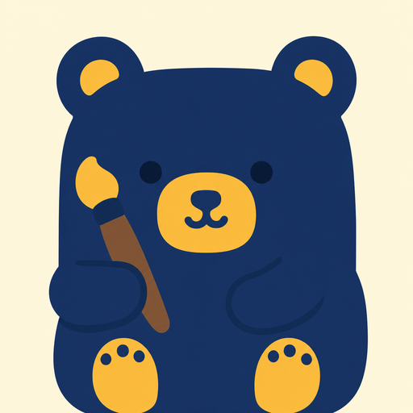
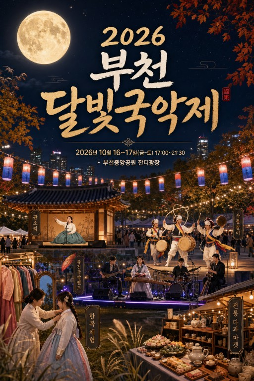
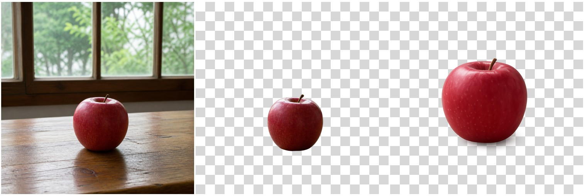
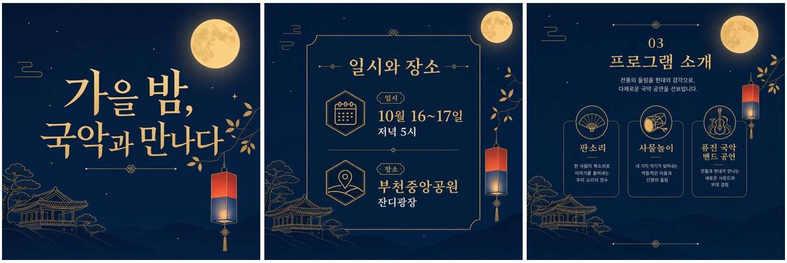
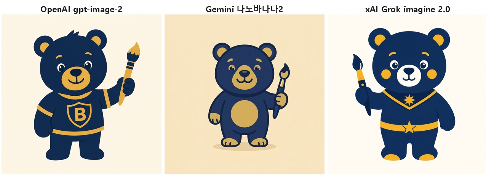

<p align="center">
  
</p>

# 곰곰 캔버스 (Gomgom Canvas)

**제안서를 끌어다 놓으면 포스터가 나오는, OpenAI gpt-image-2 기반 무한 캔버스 이미지 에디터.**

[fal-ai-community/infinite-kanvas](https://github.com/fal-ai-community/infinite-kanvas)(MIT)를 베이스로,
fal.ai 의존을 걷어내고 OpenAI Images API 직결로 재구성했다. 한국 공공 행사(축제·행사 포스터·카드뉴스) 실무를 염두에 두고 만들었다.

> An infinite-canvas image editor rebuilt on OpenAI gpt-image-2 — drop a proposal document (md/txt/PDF), get a poster. Forked from infinite-kanvas (MIT).

<p align="center">
  
</p>
<p align="center"><i>↑ 가상 제안서 md를 캔버스에 끌어다 놓고 실행 버튼 한 번 — 행사명·일시·장소·분위기가 문서에서 자동 반영된다</i></p>

## 주요 기능

| 기능 | 설명 |
|---|---|
| 🖼 **이미지 생성** | 프롬프트 → gpt-image-2. 크기 프리셋 9종(**A4 세로·가로 210dpi 인쇄용** 포함)+직접 입력, 품질 선택 |
| ✨ **프롬프트 다듬기** | "가을 국악 공연 포스터" 한 줄 → 구도·조명·색감·화풍까지 갖춘 묘사로 자동 확장 |
| 🔗 **참조 생성** | 캔버스 이미지를 선택하면 다음 생성의 참조가 됨 (**최대 16장** — 로고+무드사진+스케치 조합 가능) |
| ✂️ **부분 수정** | 🖌 브러시로 칠하거나 📍 점을 콕 찍고 지시 → 그 부분만 수정 (마스크 인페인팅) |
| 📄 **제안서 드롭** | md/txt/PDF를 캔버스에 떨어뜨리면 문서를 읽고(gpt-5-mini) 행사명·일시·장소·분위기를 뽑아 **포스터 프롬프트 자동 작성** |
| 🎨 **한국어 프리셋 12종** | 행사 포스터·카드뉴스·제안서 슬라이드·수채화·한국 전통·마스코트 등 |
| ✍️ **텍스트 레이어** | 진짜 폰트로 글자를 얹는다 — **오타 없음·수정 즉시·무료**. 한글 폰트 11종(OFL), 색 자유 지정, 모서리 핸들로 크기·회전 |
| ◇ **도형** | 사각형·동그라미·세모·별·화살표·선. 선 색·굵기·채움·투명도, 마우스로 크기 조절 |
| 📝 **메모** | "제목 더 크게" 같은 검토 메모를 붙인다 — **화면에만 보이고 결과물에는 안 찍힌다** |
| 🔥 **합치기** | 얹은 글자·도형을 원본 해상도로 이미지에 굽는다 (메모는 제외) |
| ✂️ **오려내기** | 원본 픽셀 그대로 두고 배경만 투명 — **로컬 모델(BiRefNet, MIT)·API 비용 0원**. 사진·로고처럼 원본이 변하면 안 될 때 |
| 🫥 **투명 배경 PNG** | ① 처음부터 배경 없이 생성(토글) ② AI가 피사체를 다시 그려 배경 제거 — 일러스트용 |
| 💰 **사용량 표시** | 오늘/누적 호출 수·예상 비용 상시 표시 |
| 📦 **ZIP 다운로드** | 선택한 이미지 일괄 다운로드 |
| 🔀 **제공자 3종** | OpenAI(gpt-image-2)·Gemini(나노바나나)·xAI Grok — 설정 화면에서 키 입력, 제공자별로 못 쓰는 기능은 자동 잠김 ([되는 것/안 되는 것](docs/providers.md)) |
| 🔒 **키 보호** | API 키는 중계 서버만 보관 — 브라우저·개발자도구 어디에도 노출 안 됨. 여럿이 쓰는 서버는 `LOCK_KEY_EDITING=1`로 편집 잠금 |

무한 캔버스(팬·줌·다중선택·실행취소·IndexedDB 자동저장)는 베이스 그대로.

## 실물 예시

**📍 포인트 수정** — 노란 우산을 콕 한 번 찍고 "빨간 우산으로" → 우산만 바뀌고 나머지는 그대로


**🔗 참조 생성** — 왼쪽 그림을 선택(참조)하고 "배경만 바닷가로" → 인물·화풍 유지, 배경만 교체


**✍️ 텍스트 레이어** — AI가 그린 글자는 오타 위험이 있다. 행사명·일시는 진짜 폰트로 얹어 정확하게 (아래 흰 글자)

<p align="center"></p>

**✂️ 오려내기 vs 🫥 AI 배경 제거** — 왼쪽 원본 / 가운데 오려내기(원본 픽셀 그대로) / 오른쪽 AI 배경 제거(다시 그림, 크기·모양이 달라짐)



**🗂 카드뉴스 모드** — 표지 1장 + 문구 두 줄 입력 → 같은 디자인 시스템의 내용 페이지 자동 생성



**🔀 제공자 3종 비교** — 같은 프롬프트, 왼쪽부터 OpenAI / Gemini 나노바나나2 / xAI Grok



## 실행

**요구**: Node.js 20+, OpenAI API 키

```
1. 키 설정 — 앱을 켠 뒤 설정(⚙️)에서 입력하거나,
   사용자 홈의 .env 파일에:  OPENAI_API_KEY=sk-...
   (Gemini는 GEMINI_API_KEY, Grok은 XAI_API_KEY — 자세한 차이는 docs/providers.md)

2. 의존성 설치:
   npm install --ignore-scripts
   ※ 일반 install은 상속받은 지갑 라이브러리의 네이티브 빌드에서 실패한다

3. .env.local 생성:
   NEXT_PUBLIC_APP_URL=http://localhost:3000

4. 실행 (Windows): run-canvas.bat 더블클릭
   (직접 실행 시):  NODE_OPTIONS=--no-experimental-webstorage npm run dev
   ※ Node 22+는 서버 전역에 반쪽짜리 localStorage가 있어 이 옵션 없이는 SSR이 500으로 죽는다

5. http://localhost:3000
```

## 비용 감각

high 품질 1024×1024 기준 1장당 약 $0.3 수준 (토큰 기반 추정 단가는 `src/app/api/usage/route.ts`의 `RATE` 상수에서 조정). 화면 우상단에 예상 비용이 상시 표시된다.

## 알려진 제약

- **마스크는 픽셀 경계가 아니라 "지시 대상 지정"** — 글자·사물 같은 국소 수정은 정확하지만, 넓은 배경 수정은 경계 밖까지 자연스럽게 번질 수 있다 (OpenAI 모델 특성)
- 스캔본 PDF(이미지로 된 PDF)는 텍스트 추출 불가
- 회전된 이미지에는 부분 수정 오버레이 미지원
- **오려내기는 서버에서 로컬 모델을 돌린다** — 첫 실행 때 서버가 모델(약 200MB)을 한 번 내려받고 캐시한다. 처리 시간 20~30초
- 크기 제약(실측): 가로·세로 모두 16의 배수 · 가장 긴 변 3840px 이하 · 전체 약 440만 픽셀 이하
- 원본의 fal 전용 기능(영상 생성·객체 분리)은 제거됨
- 인증 없음 — 로컬/내부망 사용 전제. 외부망에 그대로 열지 말 것

## Credits & License

MIT — [LICENSE](./LICENSE) 참조.
원작: [fal-ai-community/infinite-kanvas](https://github.com/fal-ai-community/infinite-kanvas) (MIT) — 무한 캔버스·자동저장·실행취소 등 훌륭한 뼈대에 감사를.
마스코트 프리셋의 조형 규칙은 [s1dashu/ip-as-logo-skill](https://github.com/s1dashu/ip-as-logo-skill) (MIT)에서 배웠다.
배경 오려내기 모델 [BiRefNet](https://github.com/ZhengPeng7/BiRefNet) (MIT), 실행 [@huggingface/transformers](https://github.com/huggingface/transformers.js) (Apache-2.0).
